<!-- PROJECT LOGO -->

    
  <h3 align="center">BecaGIS Tools</h3>
  

    <b><i>BecaGIS GeoProcessing Tools for QGIS</i><b>
     
  

## Descriptions
<!-- TABLE OF CONTENTS -->

  
BecaGIS GeoProcessing Tools for QGIS

  

  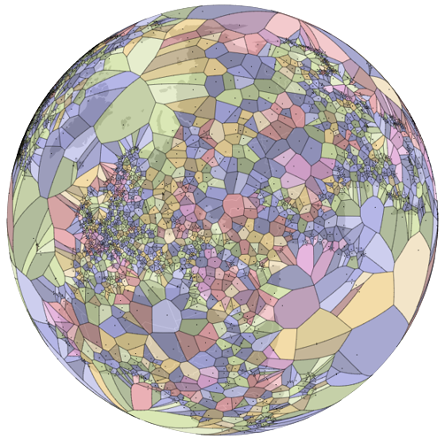

  <ol>
    <li>         
      <a href="#vector">Vector</a>     
      <ul>
        <li><a href="#antipodal-layer">Antipodal layer</a></li>
        <li><a href="#closest-farthest">The closest and farthest pair of points</a></li>
        <li><a href="#isolation">The most isololated point of a point set</a></li>
        <li><a href="#lec">The largest empty circle of a point set</a></li>
        <li><a href="#skeleton">Skeleton/ Medial Axis of Polygons</a></li>
        <li><a href="#split-polygon">Split Polygon</a></li>
      </ul>
       <li>         
      <a href="#attribute">Attribute</a>     
      <ul>
        <li><a href="#vietnamese-font-converter">Vietnamese Font Converter</a></li>
      </ul>
      <li>  
      <a href="#expressions">Expressions</a>     
      <ul>
        <li><a href="#antipode">antipode</a></li>
        <li><a href="#capitalize">capitalize</a></li>
        <li><a href="#unaccent">unaccent</a></li>
        <li><a href="#swapcase">swapcase</a></li>
        <li><a href="#tcvn3_unicode">tcvn3_unicode</a></li>
        <li><a href="#unicode_tcvn3">unicode_tcvn3</a></li>
        <li><a href="#vni_unicode">vni_unicode</a></li>
        <li><a href="#unicode_vni">unicode_vni</a></li>
      </ul>
  </ol>

## Vector

### Antipodal layer

The antipodes of any place on Earth are distant from it by 180° of longitude and as many degrees to the North of the equator as the original is to the South (or vice versa).

If the coordinates (longitude and latitude) of a point on the Earth’s surface are (θ, φ), then the coordinates of the antipodal point are (θ ± 180°,−φ). This relation holds true whether the Earth is approximated as a perfect sphere or as a reference ellipsoid.

  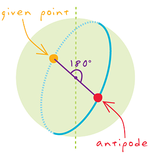

  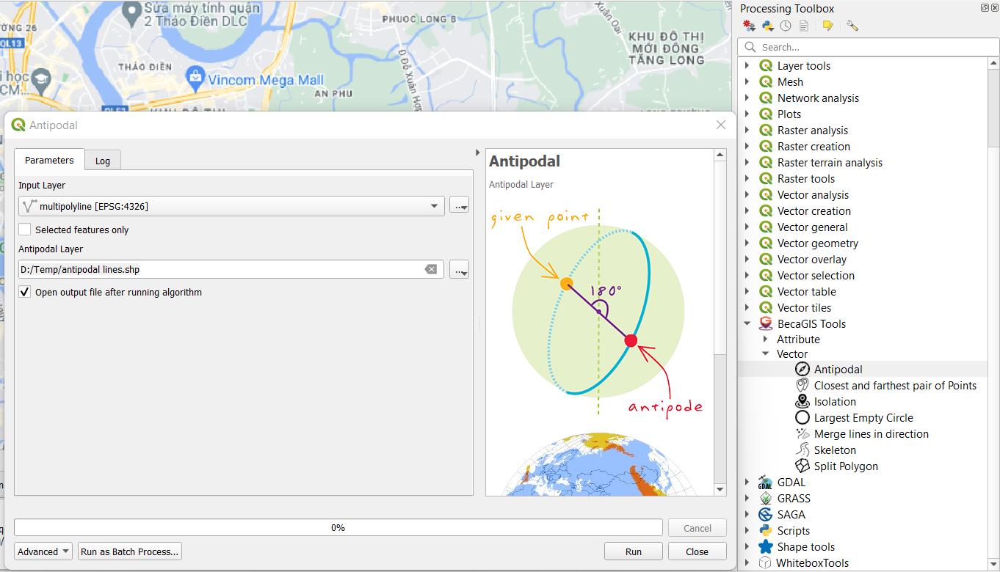

### Closest-farthest

The closest and farthest pair of Points

  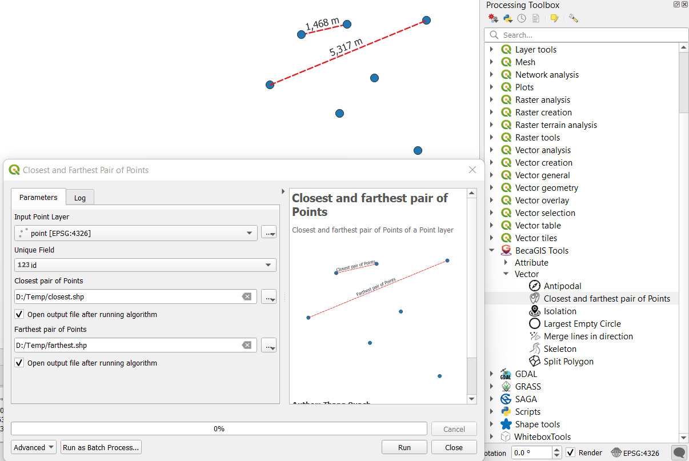

### Isolation

The most isololated point of a point set

  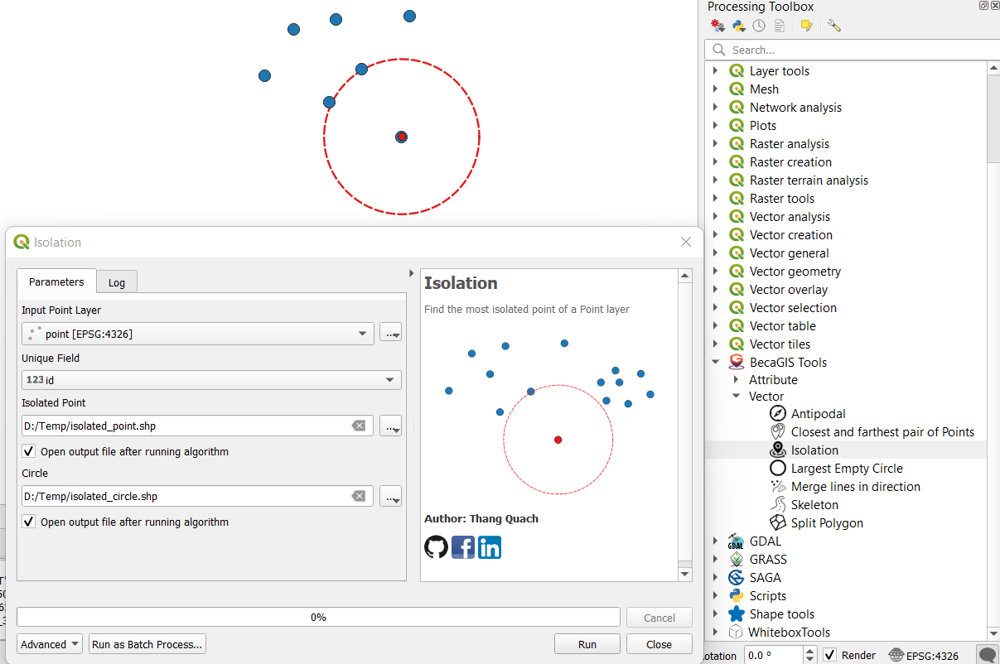

### LEC

The largest empty circle of a point set

  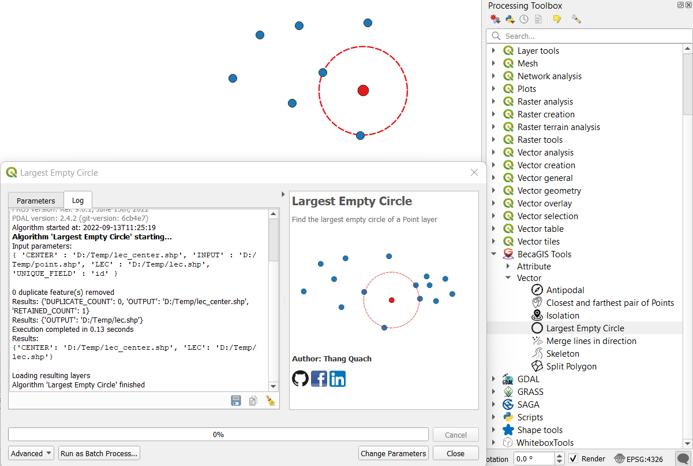

### Skeleton

Skeleton/ Medial Axis of Polygons (Output should be manually refined)

  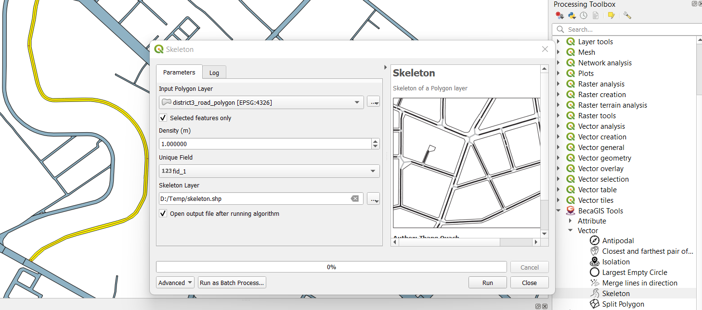

### Split Polygon

Split Polygon layer into almost equal parts using Voronoi Diagram

  

### Vietnamese Font Converter
Vietnamese Font Converter: TCVN3 <--> Unicode <--> VNI-Windows <--> Unaceented; UPPER CASE <--> lower case <--> Capitalize Each Word <--> Sentence case <--> sWAP Case

  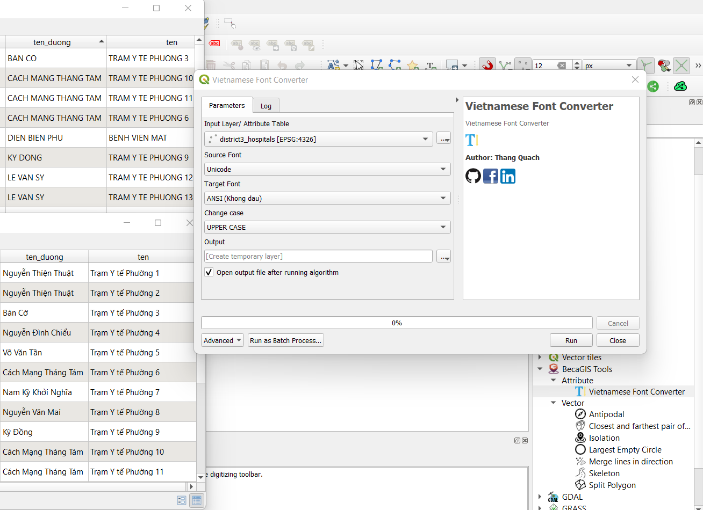

## Expressions

### antipode

Calculate antipode of a (lat, long) input.

<h4>Syntax</h4>    
<li>antipode(lat, long) 
or antipode($y, $x) in WGS84 CRS</li>    
<h4>Example usage</h4>
<ul>
<li>antipode(10.784229903855978, 106.70356815497277) &rarr; returns a point geometry</li>
<li>geom_to_wkt(antipode(10.784229903855978, 106.70356815497277)) &rarr; 'Point (-73.29643185 -10.7842299)'</li>
</ul>

  

 

  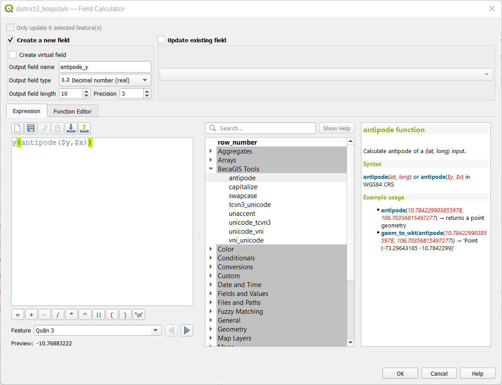

 

### capitalize

Convert text to Capitalized.

<h4>Syntax</h4>    
  <li>capitalize(string)</li>
<h4>Example usage</h4>

<ul>
  <li>capitalize('quách đồng thắng'')&rarr; 'Quách đồng thắng'</li>
</ul>   

  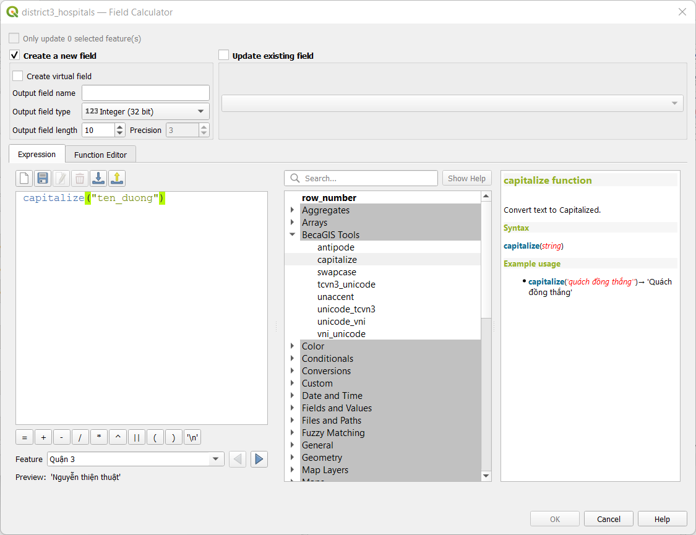

 
       

### unaccent
Convert text to unaccented.
<h4>Syntax</h4>    
  <li>unaccent(string)</li>
<h4>Example usage</h4>

<ul>
  <li>unaccent('Quách Đồng Thắng')&rarr; 'Quach Dong Thang'</li>
</ul>    

  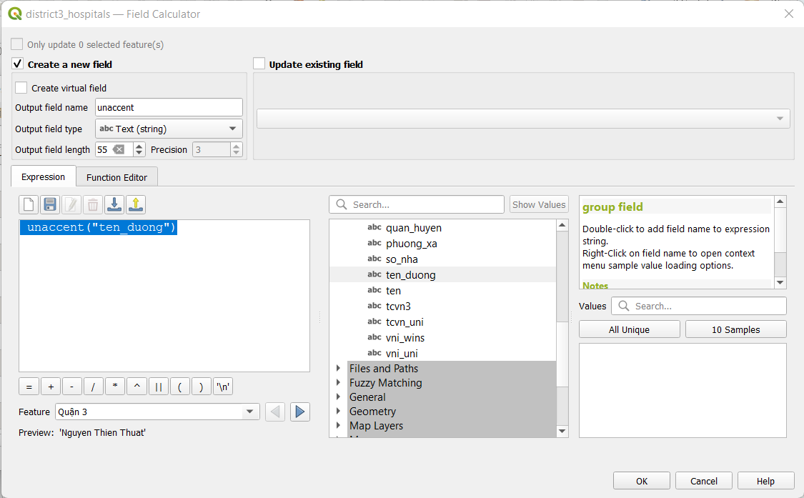

### tcvn3_unicode
Convert TCVN3 to Unicode.
<h4>Syntax</h4>    
  <li>tcvn3_unicode(string)</li>
<h4>Example usage</h4> 
<ul>
  <li>tcvn3_unicode('Qu¸ch §ång Th¾ng')&rarr; 'Quách Đồng Thắng'</li>
</ul>  

  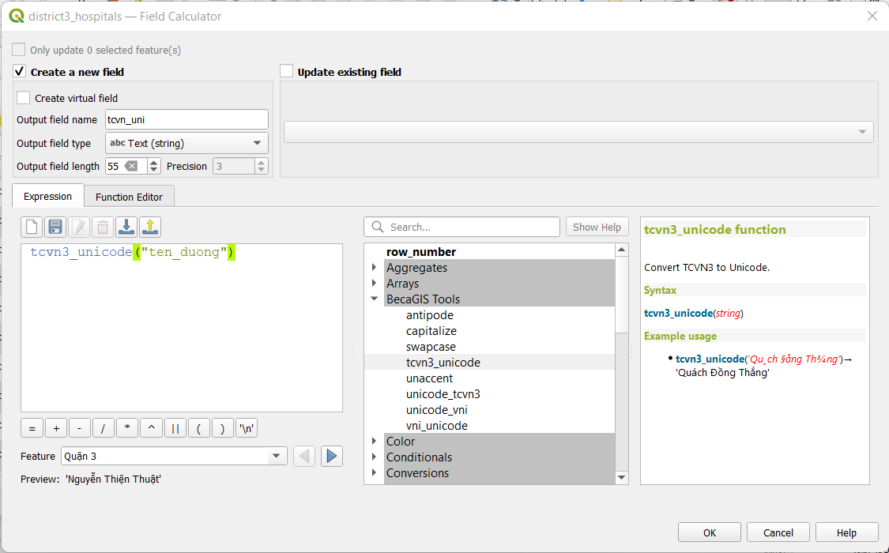

### unicode_tcvn3

Convert Unicode to TCVN3.

<h4>Syntax</h4>    
  <li>unicode_tcvn3(string)</li>
<h4>Example usage</h4>

<ul>
  <li>unicode_tcvn3('Quách Đồng Thắng')&rarr; 'Qu¸ch §ång Th¾ng'</li>
</ul>    

  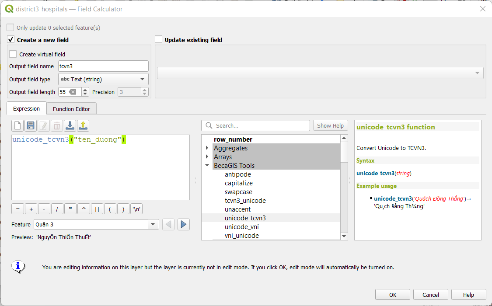

### vni_unicode
Convert VNI Windows to Unicode.
<h4>Syntax</h4>    
<li>vni_unicode(string)</li>
<h4>Example usage</h4>

<ul>
<li>vni_unicode(''Quaùch Ñoàng Thaéng'')&rarr; 'Quách Đồng Thắng'</li>
</ul>    

  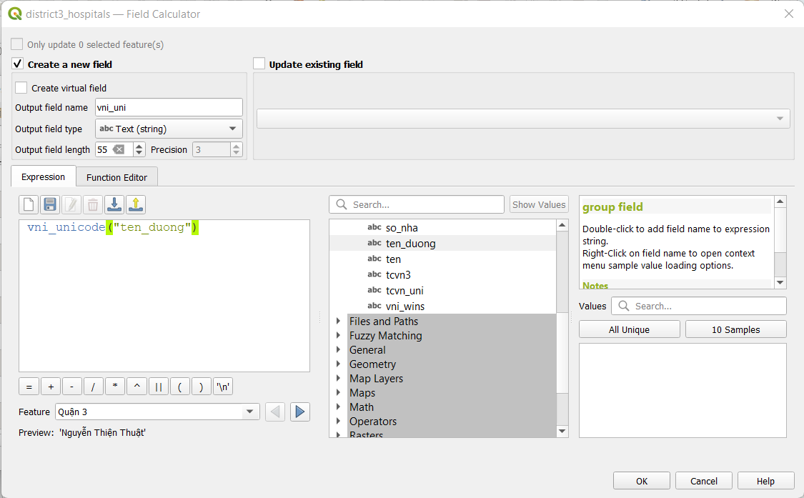

### unicode_vni

Convert Unicode to VNI Windows.

<h4>Syntax</h4>    
<li>unicode_vni(string)</li>
<h4>Example usage</h4>

<ul>
<li>unicode_vni('Quách Đồng Thắng')&rarr; 'Quaùch Ñoàng Thaéng'</li>
</ul>    

  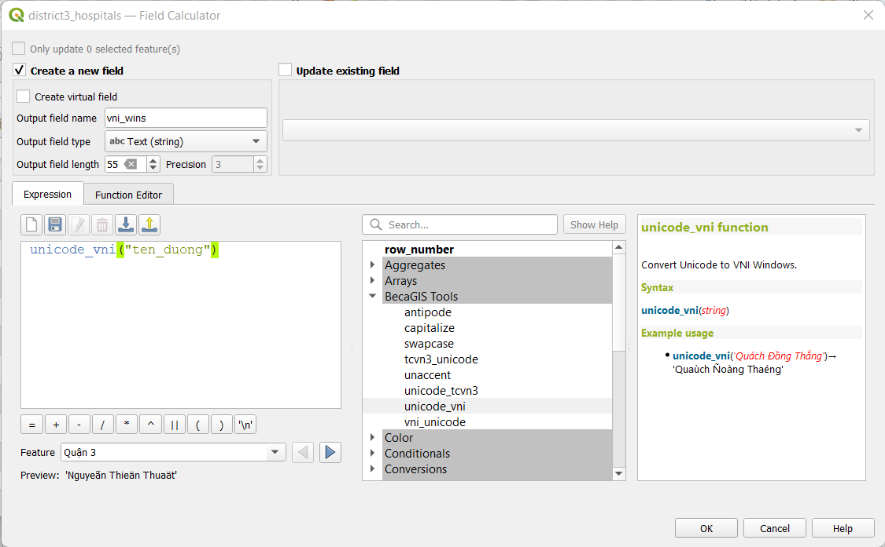

### swapcase

sWAP Case of input text

<h4>Syntax</h4>    
  <li>swapcase(string)</li>
<h4>Example usage</h4>

<ul>
  <li>swapcase('Quách Đồng Thắng')&rarr; 'qUÁCH đỒNG tHẮNG'</li>
</ul>    

  

 