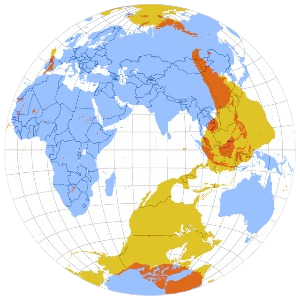
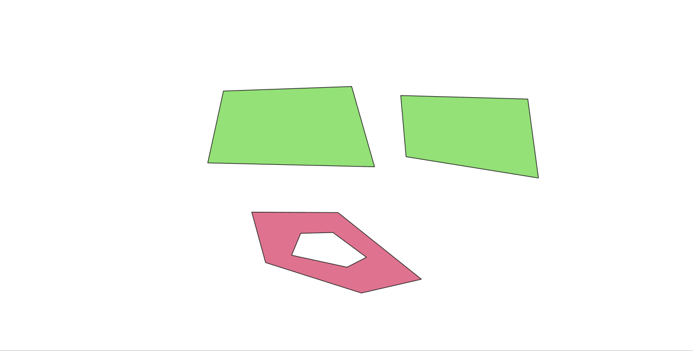
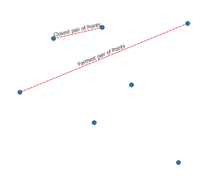
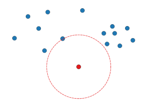
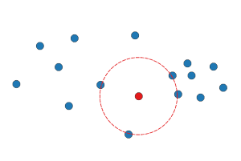
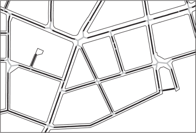

<!-- PROJECT LOGO -->

    
  <h3 align="center">BecaGIS Tools</h3>
  

    <b><i>BecaGIS GeoProcessing Tools for QGIS</i><b>
     
  

## Descriptions
<!-- TABLE OF CONTENTS -->

  
BecaGIS Processing Tools for QGIS

  

  

  <ol>
    <li>         
      <a href="#vector">Vector</a>     
      <ul>
        <li><a href="#antipodal-layer">Antipodal layer</a></li>
        <li><a href="#split-polygon">Split Polygon</a></li>
        <li><a href="#closest-farthest">The closest and farthest pair of Points</a></li>
        <li><a href="#isolation">The most isololated point of a point set</a></li>
        <li><a href="#lec">The largest empty circle of a point set</a></li>
        <li><a href="#skeleton">Skeleton/ Medial Axis of Polygons</a></li>
      </ul>
       <li>         
      <a href="#attribute">Attribute</a>     
      <ul>
        <li><a href="#vietnamese-font-converter">Vietnamese Font Converter</a></li>
      </ul>
  </ol>

## Vector

### Antipodal layer

The antipodes of any place on Earth are distant from it by 180° of longitude and as many degrees to the North of the equator as the original is to the South (or vice versa).

  

If the coordinates (longitude and latitude) of a point on the Earth’s surface are (θ, φ), then the coordinates of the antipodal point are (θ ± 180°,−φ). This relation holds true whether the Earth is approximated as a perfect sphere or as a reference ellipsoid.

  

### Split Polygon

Split Polygon layer into almost equal parts using Voronoi Diagram

  

### Closest-farthest

The closest and farthest pair of Points

  

### isolation

The most isololated point of a point set

  

### lec

The largest empty circle of a point set

  

### Skeleton

Skeleton/ Medial Axis of Polygons

  

### Vietnamese Font Converter
Vietnamese Font Converter

  

