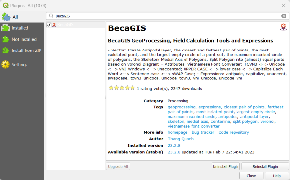
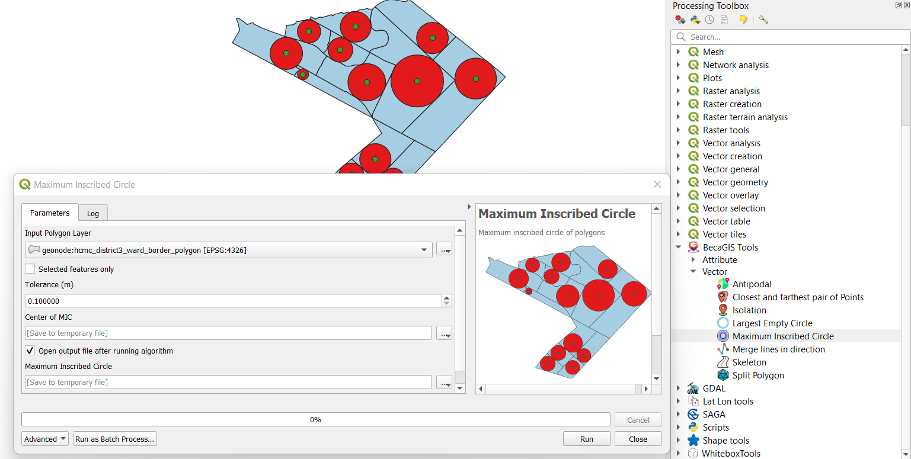

# 

    
  <h3 align="center">BecaGIS</h3>
  

    <b><i>⚙️BecaGIS GeoProcessing Tools for QGIS</i></b>
     
  

## ✅How to install

### In QGIS, go to menu Plugins 👉 Manage and Install Plugins...👉Search 'BecaGIS' 👉 Install Plugin
#### [BecaGIS Plugin on QGIS Plugin Repo](https://plugins.qgis.org/plugins/becagis/)

  

## ✅How to use
<!-- TABLE OF CONTENTS -->

  
⚙️BecaGIS GeoProcessing Tools for QGIS

  

  

  <ol>
    <li><a href="#vector">Vector</a></li>
      <ul>
        <li><a href="#antipodal-layer">Antipodal layer</a></li>
        <li><a href="#closest-farthest">The closest and farthest pair of points</a></li>
        <li><a href="#isolation">The most isololated point of a point set</a></li>
        <li><a href="#lec">The largest empty circle of a point set</a></li>
        <li><a href="#mic">The maximum inscribed circle of polygons</a></li>
        <li><a href="#skeleton">Skeleton/ Medial Axis of Polygons</a></li>
        <li><a href="#split-polygon">Split Polygon</a></li>
      </ul>
       <li><a href="#attribute">Attribute</a></li>     
      <ul>
        <li><a href="#vietnamese-font-converter">Vietnamese Font Converter</a></li>
      </ul>
      <li><a href="#expressions">Expressions</a></li>
      <ul>
        <li><a href="#antipode">antipode</a></li>
        <li><a href="#capitalize">capitalize</a></li>
        <li><a href="#unaccent">unaccent</a></li>
        <li><a href="#swapcase">swapcase</a></li>
        <li><a href="#tcvn3_unicode">tcvn3_unicode</a></li>
        <li><a href="#unicode_tcvn3">unicode_tcvn3</a></li>
        <li><a href="#vni_unicode">vni_unicode</a></li>
        <li><a href="#unicode_vni">unicode_vni</a></li>
      </ul>
  </ol>

## 🔲Vector

### Antipodal layer

The antipodes of any place on Earth are distant from it by 180° of longitude and as many degrees to the North of the equator as the original is to the South (or vice versa).

If the coordinates (longitude and latitude) of a point on the Earth’s surface are (θ, φ), then the coordinates of the antipodal point are (θ ± 180°,−φ). This relation holds true whether the Earth is approximated as a perfect sphere or as a reference ellipsoid.

  

  

### Closest-farthest

The closest and farthest pair of Points

  

### Isolation

The most isololated point of a point set

  

### LEC

The largest empty circle of a point set

  

### MIC

The maximum inscribed circle of polygons

  

### Skeleton

Skeleton/ Medial Axis of Polygons (Output should be manually refined)

  

### Split Polygon

Split Polygon layer into almost equal parts using Voronoi Diagram

  

### 📋Vietnamese Font Converter
Vietnamese Font Converter: TCVN3 <--> Unicode <--> VNI-Windows <--> Unaceented; UPPER CASE <--> lower case <--> Capitalize Each Word <--> Sentence case <--> sWAP Case

  

## 🧮Expressions

### antipode

Calculate antipode of a (lat, long) input.
<h4>Syntax</h4>
<li>
<code>antipode(lat, long) or antipode($y, $x) in WGS84 CRS</code>
</li> 
<h4>Example usage</h4>
<li>
<code> antipode(10.784229903855978, 106.70356815497277) → returns a point geometry </code>
</li>
<li>
<code>geom_to_wkt(antipode(10.784229903855978, 106.70356815497277)) → 'Point (-73.29643185 -10.7842299)'</code>
</li>
 

  

 

  

 

### capitalize

Convert text to Capitalized.

<h4>Syntax</h4>
<li>
<code>capitalize(string)</code>
</li> 
<h4>Example usage</h4>
<li>
<code> capitalize('quách đồng thắng'') → 'Quách đồng thắng' </code>
</li>
 

  

 
       

### unaccent
Convert text to unaccented.

<h4>Syntax</h4>
<li>
<code>unaccent(string)</code>
</li> 
<h4>Example usage</h4>
<li>
<code> unaccent('Quách Đồng Thắng') → 'Quach Dong Thang' </code>
</li>
 

  

### tcvn3_unicode
Convert TCVN3 to Unicode.
<h4>Syntax</h4>
<li>
<code>tcvn3_unicode(string)</code>
</li> 
<h4>Example usage</h4>
<li>
<code> tcvn3_unicode('Qu¸ch §ång Th¾ng') → 'Quách Đồng Thắng' </code>
</li>
 

  

### unicode_tcvn3

Convert Unicode to TCVN3.

<h4>Syntax</h4>
<li>
<code>unicode_tcvn3(string)</code>
</li> 
<h4>Example usage</h4>
<li>
<code> unicode_tcvn3('Quách Đồng Thắng') → 'Qu¸ch §ång Th¾ng' </code>
</li>
 

  

### vni_unicode
Convert VNI Windows to Unicode.
<h4>Syntax</h4>
<li>
<code>vni_unicode(string)</code>
</li> 
<h4>Example usage</h4>
<li>
<code> vni_unicode('Quaùch Ñoàng Thaéng') → 'Quách Đồng Thắng' </code>
</li>
 

  

### unicode_vni

Convert Unicode to VNI Windows.

<h4>Syntax</h4>
<li>
<code>unicode_vni(string)</code>
</li> 
<h4>Example usage</h4>
<li>
<code> unicode_vni('Quách Đồng Thắng') → 'Quaùch Ñoàng Thaéng' </code>
</li>
 

  

### swapcase

sWAP Case of input text

<h4>Syntax</h4>
<li>
<code>swapcase(string)</code>
</li> 
<h4>Example usage</h4>
<li>
<code> swapcase('Quách Đồng Thắng') → 'qUÁCH đỒNG tHẮNG' </code>
</li>
 

  

 
